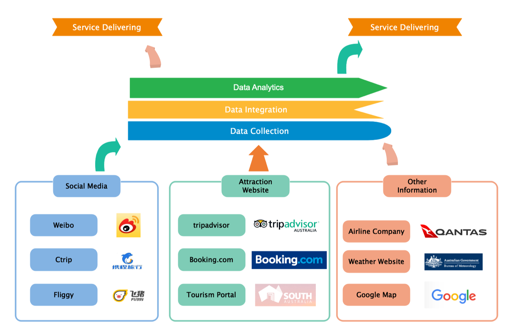
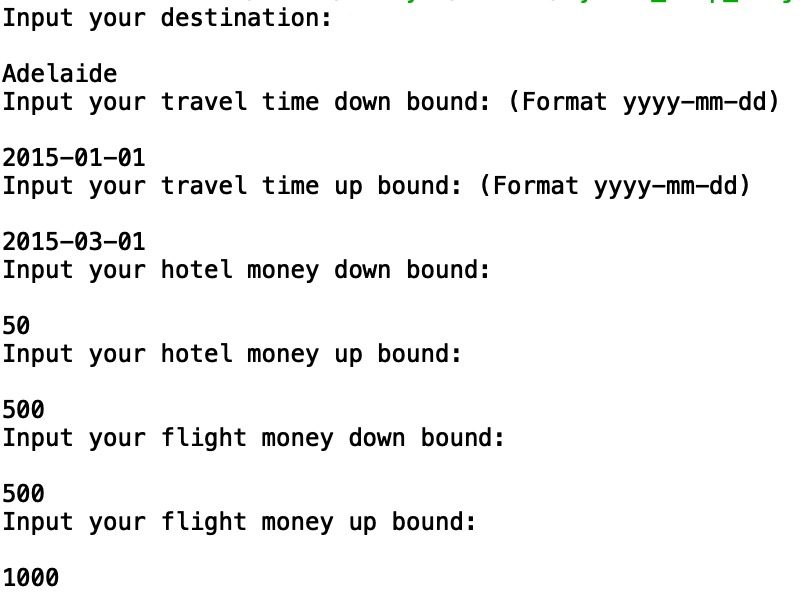
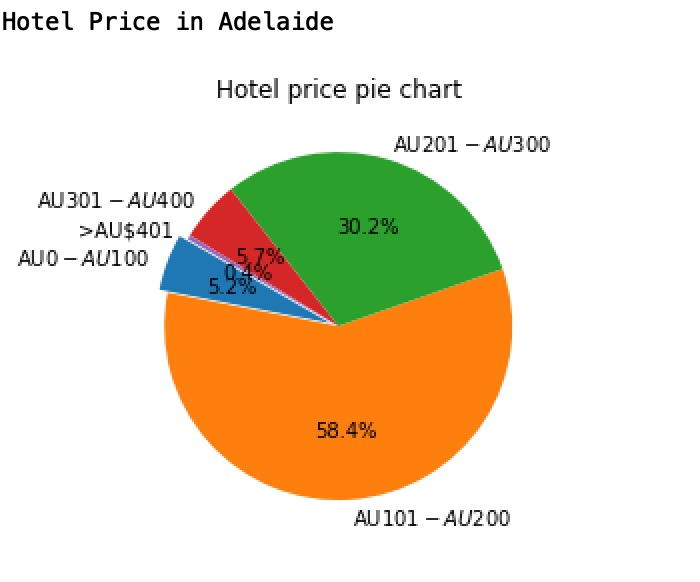
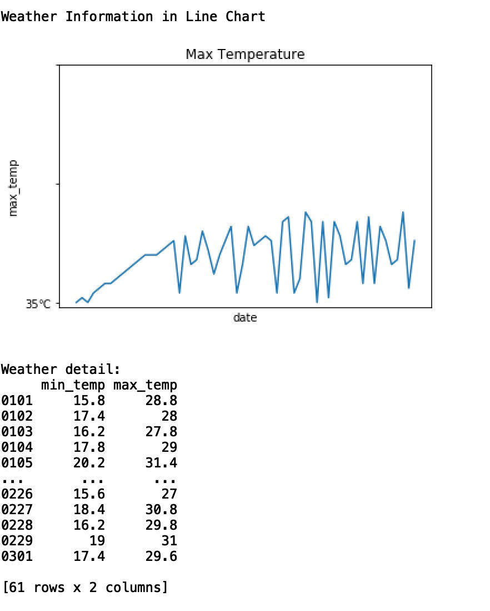
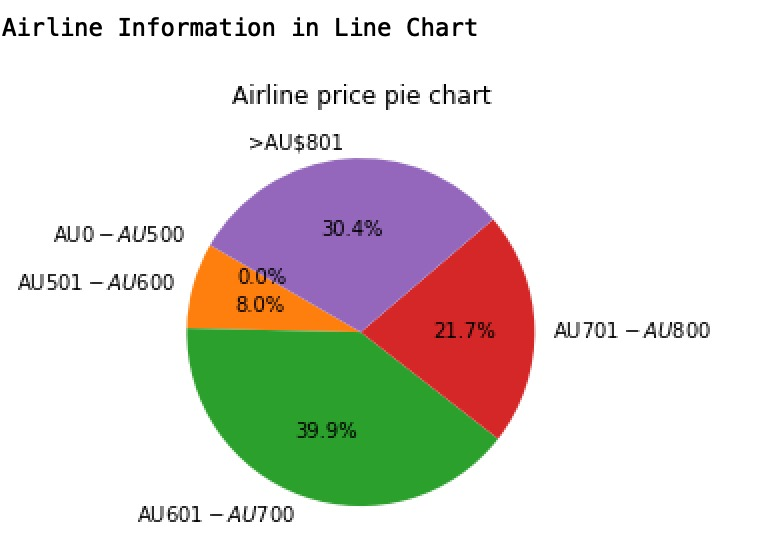
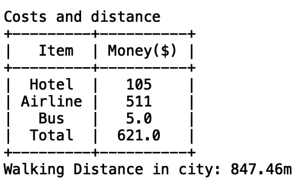

# Squad Travels, Inc. 

## 0. Group Members

Group name  | Andrew ID | Email
------------- | ------------- | -------------
Yuanli Gu  | Content Cell | 
Yuou Lei  | Content Cell |
Xinrui Zheng  | Content Cell |
Shanyue Wan  | shanyuew | shanyuew@andrew.cmu.edu
Rhea-Luz Valbuena | Content Cell | 

## 1. Abstract
**Python Trip Project** is an open source APM system, including monitoring, tracing, diagnosing capabilities for distributed system

- Service, service instance, endpoint metrics analysis
- Root cause analysis
- Service topology map analysis
- Service, service instance and endpoint dependency analysis
- Slow services and endpoints detected
- Performance optimization
- Distributed tracing and context propagation
- Database access metrics. Detect slow database access statements(including SQL statements).
- Alarm

## 2. Data source

### Analytics Process

## 3. Software Description

### Dependence

Library | Version 
------------- | ------------- 
pandas | 0.25.1
numpy | 1.16.4
matplotlib | 3.1.0 
folium | 0.10.0
wordcloud | 1.5.0
prettytable | 0.7.2
jieba | 0.39

## 4. Install and Running
### a). File Structure
> main.py
> 
> graph_generator.py
>
> map_generator.py
>
> filter_suitable_service.py
>
> weather_analysis.py
>
> NLP
> > nlp_analytics.py 
> 
> dataset
> > AdelaideMetroStops_GDA2020.json
> > 
> > AdelaideMetroStops_GDA94.json
> > 
> > airline_data.xlsx
> > 
> > ctrip_cleaned_data.csv
> > 
> > hotel_data.xlsx
> > 
> > weather_data.xlsx

### b). Library Install

`pip install -r requirements.txt`

### c). Running

Running the main modle.

Input City: `Adelaide`

Input Beginning Time: `2015-01-01`

Input Ending Time: `2015-04-01`

Input Down-Bound Hotel Price: `50`

Input Up-Bound Hotel Price: `500`

## 5. Live Deomo
### a). Get Input

### b). Hotel Price Pie Chart

### c). Temperature Line Chart

### d). Airline Price Pie Chart

### e). Map Visualization

### f). Plan Steps

### g). Cost and Distance Steps

### h). Word Clouds

## 6. Scrape
### Ctrip Comments Scrape
### Hotel Data
### Airline Data
### Weather Data 
### Adelaide Bus Data 